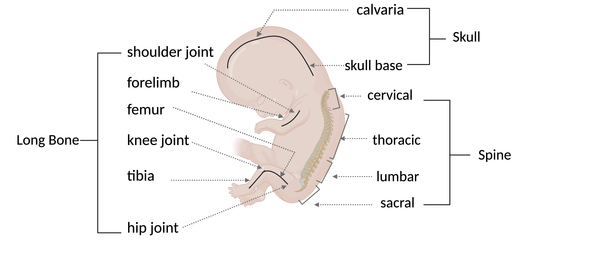

# BoneAtlasProject

A standard Haniffa Lab project repository containing all code and metadata used to generate a single-cell and spatial atlas of prenatal human bone marrow haematopoiesis.

---

## About

This repository contains the full computational analysis pipeline used to construct and analyse a comprehensive single-cell atlas of prenatal human bone marrow haematopoiesis across multiple skeletal sites, including skull, spine, and long bones.

Human haematopoiesis arises in successive developmental waves across distinct anatomical sites, transitioning from extra-embryonic tissues (yolk sac) to intra-embryonic organs (AGM, liver), before the bone marrow becomes the dominant site of immune cell production. While prenatal bone marrow haematopoiesis has been studied primarily in long bones, the contribution of other marrow sites such as the spine and skull remains poorly characterised.

To address this, this project integrates single-cell RNA sequencing, single-nucleus RNA sequencing, and spatial transcriptomics (Visium) data spanning post conception weeks (PCW) 5-19. The resulting Bone Atlas comprises samples from 59 human embryos, profiled across 203 libraries, and captures the emergence, diversification, and spatial organisation of haematopoietic cell types across distinct bone marrow environments.

This repository provides all code required to reproduce the data processing, integration, annotation, and downstream analyses presented in this project, including cross-organ comparisons and spatial analyses.

---

## Overview figure

**Figure:** Overview of the prenatal human bone marrow atlas across skull, spine, and long bones.

## Project Team

Shaista Madad  
Wellcome Sanger Institute  
[sm54@sanger.ac.uk](mailto:sm54@sanger.ac.uk)

Professor Muzlifah Haniffa  
Wellcome Sanger Institute  
[mh32@sanger.ac.uk](mailto:mh32@sanger.ac.uk)

---

## Contact

Professor Muzlifah Haniffa  
Wellcome Sanger Institute  
[mh32@sanger.ac.uk](mailto:mh32@sanger.ac.uk)

---

## Repository structure

- **metadata/**  
  Sample metadata, marker gene tables, legacy annotations, and demultiplexing (souporcell) results.

- **analysis/**  
  Core data processing, integration, and analysis pipelines for single-cell and spatial datasets.

- **figures/**  
  Figure generation code and analysis summaries.

- **environment/**  
  Environment setup files and dependency specifications.

- **data/**  
  Processed data objects used for downstream analysis and figure generation, including summary outputs for Visium data.

---

## Branches

### `main`
Protected branch representing stable, production-ready code corresponding to completed analyses.

### `dev`
Active development branch. Code is expected to run but may be under active development or refactoring.

